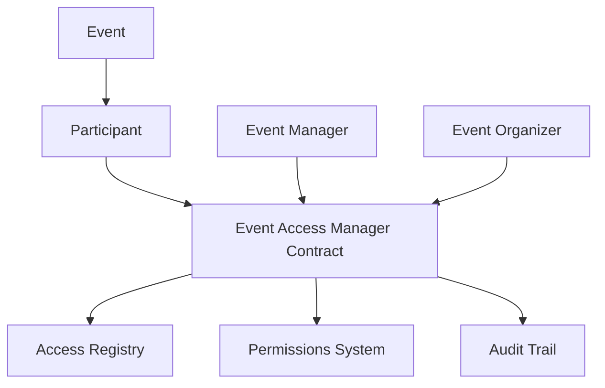

# Mini Event Pattern

A blockchain-based platform for secure, participant-controlled event access management.

## Overview

Mini Event Pattern creates a secure platform where event participants can maintain ownership and control over their event-related data while selectively sharing it with event managers, organizers, and stakeholders. Built on the Stacks blockchain, the system ensures data integrity and precise access control without storing sensitive event information on-chain.

### Key Features

- Participant-controlled event access permissions
- Secure event registration system
- Verified event manager authentication
- Comprehensive access audit trail
- Support for multiple event types

## Architecture

The Mini Event Pattern system is built around a core smart contract that manages:
- Participant registration and authentication
- Event registration and management
- Access control and permissions
- Event manager verification
- Access history and auditing



## Contract Documentation

### Event Access Manager Contract

The main contract (`event-access-manager.clar`) handles all core functionality for the Mini Event Pattern system.

#### Event Types Supported
- Conferences
- Workshops
- Seminars
- Webinars
- Networking Events
- Training Sessions
- Summits

#### Key Components

1. **Participant Management**
   - Participant registration
   - Event registration and management
   
2. **Access Control**
   - Permission granting/revoking
   - Event manager verification
   - Access request handling

3. **Audit System**
   - Comprehensive access logging
   - Historical access tracking

## Getting Started

### Prerequisites
- Clarinet
- Stacks wallet
- Access to the Stacks blockchain

### Basic Usage

1. **Register as a Participant**
```clarity
(contract-call? .event-access-manager register-participant)
```

2. **Register an Event**
```clarity
(contract-call? .event-access-manager register-event "event-123" "conference")
```

3. **Grant Access to an Event Manager**
```clarity
(contract-call? .event-access-manager grant-event-access 
    'SP2JXKH6B14RMT7PP51439ZPWZQYNB3HB5J2289WB 
    "conference" 
    (some u100000))
```

## Function Reference

### Public Functions

#### Participant Management
```clarity
(define-public (register-participant))
(define-public (register-event (event-id (string-ascii 64)) (event-type (string-ascii 64))))
(define-public (remove-event (event-id (string-ascii 64))))
```

#### Access Control
```clarity
(define-public (grant-event-access (manager principal) (event-type (string-ascii 64)) (expiry (optional uint))))
(define-public (revoke-event-access (manager principal) (event-type (string-ascii 64))))
```

### Read-Only Functions
```clarity
(define-read-only (check-participant-registration (participant principal)))
(define-read-only (check-manager-verification (manager principal)))
(define-read-only (check-event-access (participant principal) (manager principal) (event-type (string-ascii 64))))
(define-read-only (get-access-details (access-id uint)))
```

## Development

### Testing
1. Clone the repository
2. Install Clarinet
3. Run tests:
```bash
clarinet test
```

### Local Development
1. Start Clarinet console:
```bash
clarinet console
```
2. Deploy contracts:
```clarity
(contract-call? .event-access-manager register-participant)
```

## Security Considerations

### Data Privacy
- No actual event details are stored on-chain
- Only access permissions and audit logs are maintained on-chain
- All sensitive data should be stored off-chain with appropriate encryption

### Access Control
- Implement additional verification for event manager registration in production
- Regular audit of access logs
- Time-bound access permissions recommended
- Immediate access revocation available

### Best Practices
- Always verify event manager identity off-chain
- Regularly review and update access permissions
- Monitor access history for unauthorized attempts
- Use time-limited access grants when possible